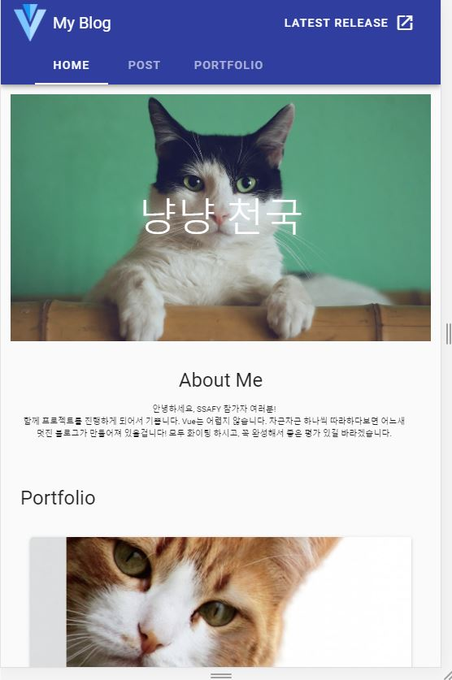
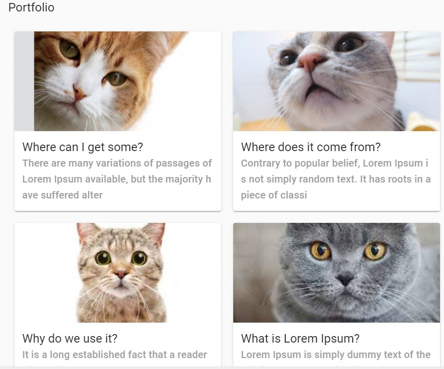
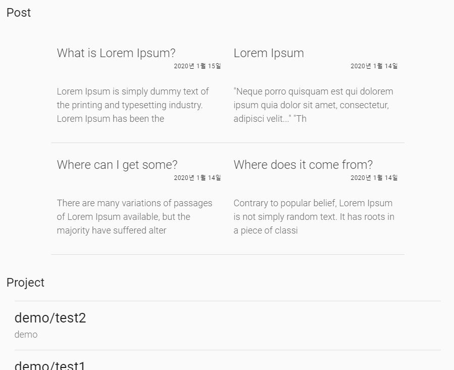

# SW 개발 비서

**반응형 단일 페이지 애플리케이션 구현**
웹의 기본 기능과 반응형 디자인으로 자신만의 포트폴리오를 발전 시킬 수 있는 기술 블로그로 다양한 API를 적용한 사용자 기능과 관리자 기능을 강화하여 개발자로써 활용성을 높게 가져갈 수 있는 SW 개발 비서 서비스입니다. 


## Overview

- node.js
- vue.js
- firebase([deploy](https://neungle-webservice.firebaseapp.com/))


## Prerequisites

Make sure you have installed all of the following prerequisites on your development machine:
 - Git - [Download & Install Git](https://git-scm.com/downloads). OSX and Linux machines typically have this already installed.
 - Node.js - [Download & Install Node.js](https://nodejs.org/en/download/) and the npm package manager. If you encounter any problems, you can also use this [GitLab Issue](https://lab.ssafy.com/webmobile1-sub1/s02p11d152/issues) to install Node.js.
 - Firebase - [Firebase](https://firebase.google.com/?hl=ko) create new project


 ## Setup & Build

 ### Vue

프로젝트를 로컬 스토리지에 저장
```bash
$ git clone https://lab.ssafy.com/webmobile1-sub1/s02p11d152.git
```

기본적인 패키지들을 설치
``` bash
$ cd s02p11d152/ssafy-frontend
$ npm install 
```

프로젝트를 빌드
```bash
$ npm run build
```


## Run

로컬에서 프로젝트 실행
```bash
$ cd s02p11d152/ssafy-frontend
$ npm run serve
```


## Depoly

### Firebase 

Firebase CLI 설치
```bash
$ npm install -g firebase-tools
```

Google 로그인
```bash

$ firebase login
```
> 현재 프로젝트는 이미 firebase init을 통해 배포에 필요한 setting을 가지고 있으므로 `init`명령어는 생략

Firebase 배포
```bash
$ firebase deploy
```
> 배포 단계에서 배포 directory를 설정하는 부분이 나오는데 해당 부분 `dist`로 설정


## Description


**Main** 

사이드바에 마우스를 올려두면 사이드바가 OPEN된다. 오픈된 사이드바에는 각 페이지로 이동할 수 있는 메뉴 버튼이있다. Home & Post & Portfolio 으로 이동이 가능하다.




**Mobile**

모바일 버전에서는 사이드가 위로 올라가 화면을 크게 볼 수있다.




**Portfolio**




**Post & Repository**